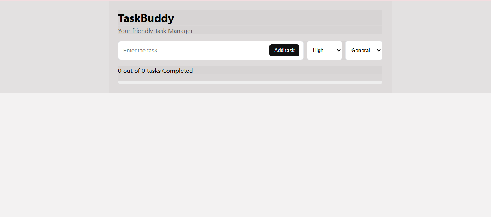
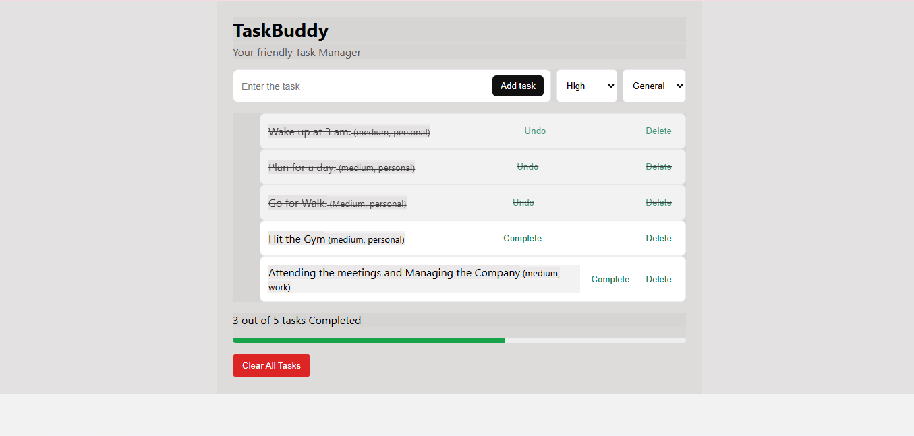

# TaskBuddy – A Simple and Efficient Task Management App

TaskBuddy is a React + Vite-based task management application that allows users to add, track, and manage their daily tasks easily.  
This project demonstrates core React concepts like components, props, state, hooks, and file structuring.

---

## 🚀 Features
- Add new tasks  
- Mark tasks as complete  
- Delete tasks  
- Progress tracking  
- Responsive UI  
- Local storage support (tasks persist even after refresh)

---

## 🛠️ Tech Stack
- **React**
- **Vite**
- **JavaScript (ES6+)**
- **CSS**
- **Local Storage API**

---

## 📂 Folder Structure
src/
│── components/
│ ├── TaskForm.jsx
│ ├── TaskList.jsx
│ ├── ProgressTracker.jsx
│── App.jsx
│── main.jsx
│── index.css


---

## 📦 Installation & Setup

```bash
# 1. Clone the repository
git clone https://github.com/Sandeep551-gif/Task-Buddy-App.git

# 2. Install dependencies
cd Task-Buddy-App
npm install

# 3. Start the development server
npm run dev

## 📸 TaskBuddy Screenshots 
### 🔹 Home Page


### 🔹 Progress Tracker



💡 Future Enhancements

Dark mode

Drag-and-drop tasks

User authentication

Backend integration (Node.js)

🤝 Contributing

Contributions, issues, and feature requests are welcome!

📄 License

This project is open-source and available under the MIT License.


---

# ✔️ **After creating README.md, upload it to GitHub**
Run:

```bash
git add README.md
git commit -m "Added professional README"
git push


# React + Vite

This template provides a minimal setup to get React working in Vite with HMR and some ESLint rules.

Currently, two official plugins are available:

- [@vitejs/plugin-react](https://github.com/vitejs/vite-plugin-react/blob/main/packages/plugin-react) uses [Babel](https://babeljs.io/) (or [oxc](https://oxc.rs) when used in [rolldown-vite](https://vite.dev/guide/rolldown)) for Fast Refresh
- [@vitejs/plugin-react-swc](https://github.com/vitejs/vite-plugin-react/blob/main/packages/plugin-react-swc) uses [SWC](https://swc.rs/) for Fast Refresh

## React Compiler

The React Compiler is not enabled on this template because of its impact on dev & build performances. To add it, see [this documentation](https://react.dev/learn/react-compiler/installation).

## Expanding the ESLint configuration

If you are developing a production application, we recommend using TypeScript with type-aware lint rules enabled. Check out the [TS template](https://github.com/vitejs/vite/tree/main/packages/create-vite/template-react-ts) for information on how to integrate TypeScript and [`typescript-eslint`](https://typescript-eslint.io) in your project.
